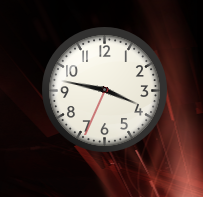
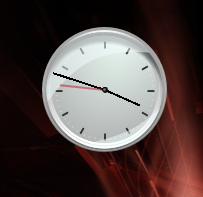

# Win Gadgets

## Microsoft® Windows™ is a registered trademark of Microsoft® Corporation. This name is used for referential use only, and does not aim to usurp copyrights from Microsoft. Microsoft Ⓒ 2024 All rights reserved. All resources belong to Microsoft Corporation.

## Introduction
This repository contains some remade Windows gadgets for use in KDE Plasma 6. Some gadgets are missing their expanded variants or have some slight inaccuracies.


## Installation
Move the plasmoids folder to ```~/.local/share/plasma/```


## Screenshots

### Clock
Default style:



System style:



### Weather


### Image slideshow


### RSS Feeds


## TODO
1. Calendar
2. CPU usage
