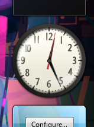
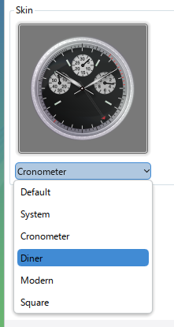
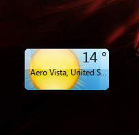
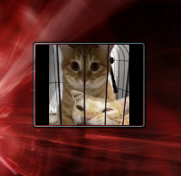
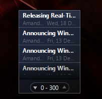
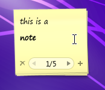
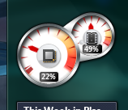

# Win Gadgets

## Microsoft® Windows™ is a registered trademark of Microsoft® Corporation. This name is used for referential use only, and does not aim to usurp copyrights from Microsoft. Microsoft Ⓒ 2025 All rights reserved. All resources belong to Microsoft Corporation.

## Introduction

This repository contains (some) recreated Windows gadgets for use within KDE Plasma 6, specifically [VistaThemePlasma](https://gitgud.io/catpswin56/vistathemeplasma) and [AeroThemePlasma](https://gitgud.io/wackyideas/aerothemeplasma). Some gadgets are missing their expanded variants or have some slight inaccuracies.

## Installation

### Required packages

**Arch Linux:** ``kunitconversion kholidays``

**Debian:** ``libkf6unitconversion-dev libkf6holidays-dev``

**Fedora:** ``kf6-kunitconversion-devel kf6-kholidays-devel``

### After installing the packages

1. Clone this repository
2. Go into the repository folder and run
```sh
$ sh install.sh
```
to install the plasmoids into ``~/.local/share/plasma/plasmoids/`` automatically

3. Add any of the plasmoids into your desktop


## Screenshots

### Clock



**Available styles:**



### Weather



### Image slideshow



### RSS Feeds



### Notes



### CPU



## Credits
* [WackyIdeas](https://gitgud.io/wackyideas/) for adding a context menu, automatic text colorization, resizing support and doing bugfixes to the notes gadget.

## TODO

1. Improve the install guide
2. Calendar
3. Make the script also install the gadget icons
4. Add more clock screenshots
5. Add the missing clock styles
